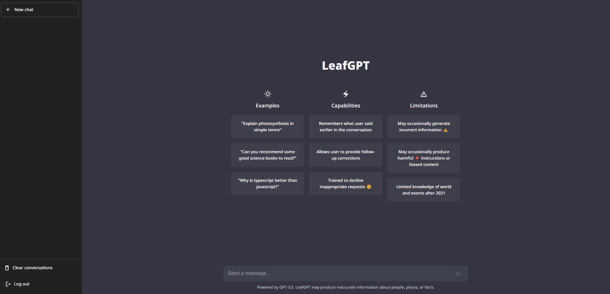
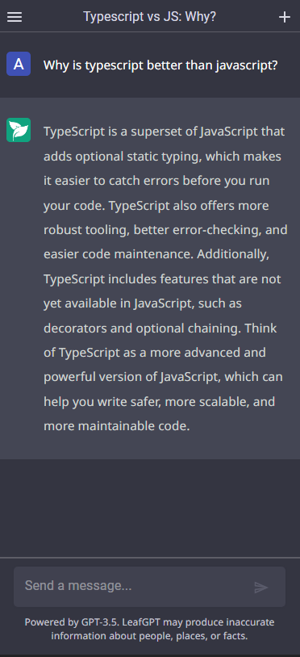

# LeafGPT 💬

LeafGPT is an open source ChatGPT clone, created with React (frontend) and NodeJS (backend).
It works the same as ChatGPT, but it's open source and you can host it yourself.

Note that

-   this project is still in development (doesn't have a build yet)
-   this is not a fork of ChatGPT, it's a complete rewrite from scratch
-   this is powered by GPT-3.5 model by OpenAI
-   you can contribute to this project by opening a pull request or an issue

### Important

To use this project, you need to have an OpenAI API key. You can get one [here](https://beta.openai.com/).
 

## Back-End

The backend is built with NodeJS (Typescript) using:

-   [Express](https://expressjs.com/)
-   [Cors](https://www.npmjs.com/package/cors)
-   [OpenAI API](https://beta.openai.com/docs/api-reference/introduction)
-   [MongoDB](https://www.mongodb.com/)
-   [mongoose](https://mongoosejs.com/)
-   [Socket.io](https://socket.io/docs/v3/index.html)
-   [dotenv](https://www.npmjs.com/package/dotenv)
-   [nodemailer](https://nodemailer.com/about/)
-   [bcrypt](https://www.npmjs.com/package/bcrypt)
-   [jsonwebtoken](https://www.npmjs.com/package/jsonwebtoken)

<table style="width: 100%; border: none;" cellspacing="0" cellpadding="0" border="0">
    <tr>
        <td style="width: 75%; border: none!important;" valign="center">
            
        </td>
        <td style="width: 25%; border: none!important;" valign="center">
            
        </td>
    </tr>
<table>

## Node Server Scripts

In the project directory, you can run:

### `npm start`

Starts the server in development mode. **Note that you need to have installed [nodemon](https://nodemon.io/).**
